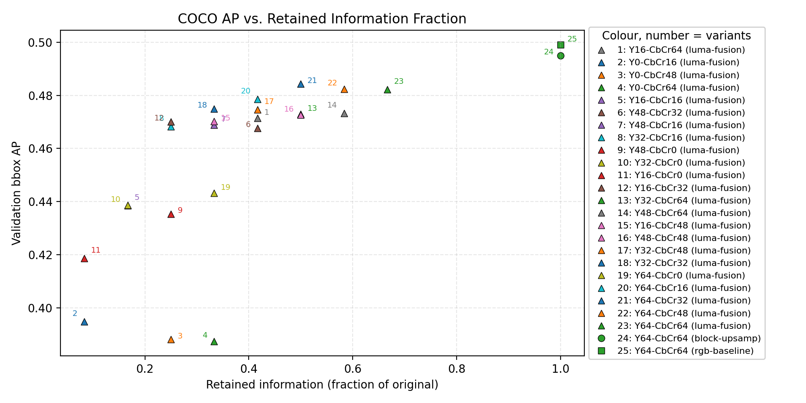

# RT-DETRV2 for intra coding VOP mpeg4 part2



Optimized RT-DETRv2 pipelines for MPEG-4 part2 intra-coded VOP streams decoded in the DCT domain. The repo packages training and evaluation recipes that fuse luminance/chrominance coefficients directly into the detector backbone.

## Train on COCO (compressed input)
- Place COCO 2017 under `dataset/detection/coco/` and activate the `detr-compressed` environment.
- Example command (luma-fusion window, ResNet-34 backbone):
```shell
CUDA_VISIBLE_DEVICES=0,1,2,3 \
torchrun --master_port=9909 --nproc_per_node=4 tools/train.py \
      -c configs/rtdetrv2/lumafusion_coeffs/rtdetrv2_r34vd_lumafusion_coeffY64_Cb64_Cr64_120e_coco.yml \
      --use-amp --seed 0
```
- Swap the config path to explore other coefficient windows (see `configs/rtdetrv2/lumafusion_coeffs/`).

## Documentation
- Compressed backbones: `docs/compressed_backbones/`
- RT-DETRv2 DCT variants and launch recipes: `docs/rtdetr_variants/`
- Doc index: `docs/README.md`

---
## Citation
If you use `RTDETR` or `RTDETRv2` in your work, please use the following BibTeX entries:

<details>
<summary> bibtex </summary>

```latex
@misc{lv2023detrs,
      title={DETRs Beat YOLOs on Real-time Object Detection},
      author={Wenyu Lv and Shangliang Xu and Yian Zhao and Guanzhong Wang and Jinman Wei and Cheng Cui and Yuning Du and Qingqing Dang and Yi Liu},
      year={2023},
      eprint={2304.08069},
      archivePrefix={arXiv},
      primaryClass={cs.CV}
}

@misc{lv2024rtdetrv2improvedbaselinebagoffreebies,
      title={RT-DETRv2: Improved Baseline with Bag-of-Freebies for Real-Time Detection Transformer}, 
      author={Wenyu Lv and Yian Zhao and Qinyao Chang and Kui Huang and Guanzhong Wang and Yi Liu},
      year={2024},
      eprint={2407.17140},
      archivePrefix={arXiv},
      primaryClass={cs.CV},
      url={https://arxiv.org/abs/2407.17140}, 
}
```
</details>
